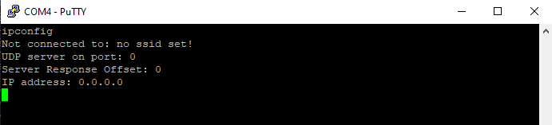

# UDP - UART Bridge

This is arduino firmware to create a UDP to UART bridge device on an ESP32.

The ESP32 is configured as in _STA mode, i.e. must be connected to a router. The settings are managed over Serial, via a command-line interface.

## Configuration Instructions

### Serial Client

To begin using the Serial command line, you must have a capable Serial client.



PuTTY (lightweight, easy install) or Arduino IDE are both good options. Ensure you have configured your serial client to use 921600 baud, or else modify the default initialization of the `Serial` module to a suitable baudrate.

### Connecting to WiFi

When setting up the device for the first time, you must configure the following settings at minimum:

1. Set the ssid and password of your target wifi network:

```
setssid example-2.4Hgz
```
Make sure that the network is 2.4Ghz - this is required for ESP32 devices.

2. Set password:

```
setpwd example-password
```

Note: passwords will be stored in plaintext on the device and can be read back over serial. Physical access is required. Do not use on a secure network. 

At this point, the device should be connected to your network. You can type:

```
ipconfig
```

into the command line to get connectivity status. If you have typed valid credentials, you should be connected and have been assigned a valid IP address.

If you do not connect right away, you can type:

```
restart
```
 
Into the command line to easily restart your device.

### UDP/UART Server Configuration

The device will not function unless you assign a port to the UDP server. You can do so with the command:

```
setport <port number>
```

For example,  `setport 5541`. You should see that the  port number has updated when you type `ipconfig`.

You also must configure the baudrate of the UART. By default the baudrate will be 2000000. You can set the baudrate with:

```bash
setbaudrate 921600
```

and read the baudrate with

```
readbaudrate
```

You must `restart` the device for this to take effect. 

The UDP server also has a 'port offset' option. The device will transmit replies with that offset from the sourceport. So if you send a packet to the device on port 5541, and the port offset is set to 1, the device will route traffic to your ip with destination port 5542.

It is recommended to leave this at the default setting of zero, unless your application has a specific need for splitting ports (such as multiple client applications with tx/rx bifurcation).

### LED configuration

This device blinks an LED indicator light to indicate WiFi connection status. Slow blinking indicates no connection, while fast blinking indicates an active connection.

By default, pin `32` is used as the led pin. You will likely need to reconfigure the LED pin based on your hardware: the most common LED pin is `2` on cheap ESP32 dev kits.

```bash
setledpin 2
```

`32` will remain the default because I'm mainly using this firmware on the ESP32-cortex boards. 

### Static IP Configuration

In a robotics application, a simple network using static IP's can make a lot of sense, especially to reduce the complexity of device discovery and identification. By default, these devices will not configure themselves with a static ip. In order to assign one, use the following commands:

```bash
setstaticip 192.168.0.25    #example static ip
```

If a static ip is requested, the subnet mask will automatically be set to:

```
255.255.255.0
```

To manipulate the subnet mask, gateway, and dns settings, you can use the following commands:

```bash
setsubnetmask 255.255.0.0   #example subnet mask
setgateway  192.168.1.1 #defaults to 0.0.0.0 - set if NAT traversal is required in your application
setdns 8.8.8.8  #defaults to 0.0.0.0 - set if WAN DNS is required in your application
```

*Important Note*: you must `restart` the device for any static ip settings to take effect!

### I2S Microphone

This device is capable of streaming audio from an I2S microphone over UDP. This feature is disabled by default. Refer to [this repository](https://github.com/ocanath/realtime-audio-udp) for details on frame format, etc. 